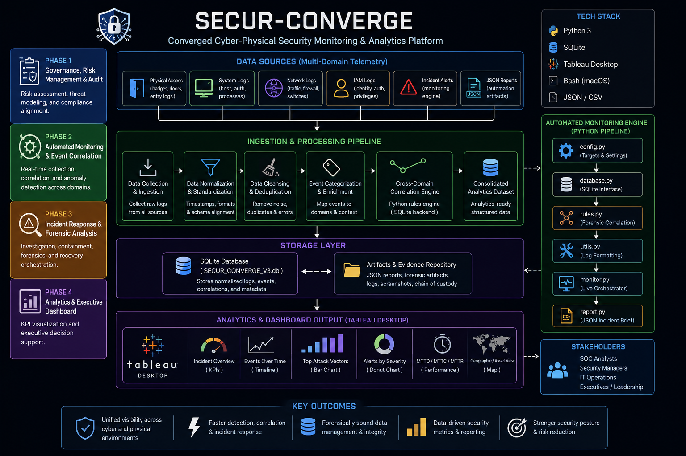

# 🛡️ SECUR-CONVERGE


## Executive Dashboard


### Designing a Cyber-Physical Security Program for a Multi-Site Enterprise


---

## Project Overview

**SECUR-CONVERGE** is an end-to-end cyber-physical security portfolio project demonstrating the implementation of a converged security program for a fictional multi-site organization (**SECUR-CORP**).

The project combines Governance, Risk Management, Security Monitoring, Digital Forensics, Incident Response, and Executive Analytics into a single operational workflow.

Unlike isolated cybersecurity exercises, this project demonstrates how physical security events (badge access, CCTV, facility controls) can be correlated with digital security telemetry (system logs, authentication events, network activity) to improve organizational resilience.

This project is inspired by my professional experience supervising physical security operations and combines that background with modern cybersecurity methodologies including:

- Google Cybersecurity Professional Certificate
- NIST Cybersecurity Framework (CSF 2.0)
- NIST SP 800-30 Risk Assessment
- Security Operations (SecOps)
- Digital Forensics
- Security Data Analytics

---

# Project Architecture

```text
                    Physical Security Logs
                    Badge Access
                    CCTV Events
                    Facility Controls
                            │
                            ▼
                     SQLite Database
                            │
                            ▼
               Python Monitoring Engine
           (Correlation & Detection Rules)
                            │
                            ▼
              cybersecurity_brief.json
                            │
                            ▼
              Tableau Executive Dashboard
                            │
                            ▼
             Executive Decision Support
```
### Visuals


---

# Project Phases

## Phase 1 — Governance, Risk Management & Audit

Objectives

- Security Assessment
- Risk Identification
- Vulnerability Assessment
- NIST SP 800-30 Risk Analysis
- NIST CSF 2.0 Recommendations

Deliverables

- Audit Report
- Risk Matrix
- Security Recommendations
- Governance Assessment

---

## Phase 2A — Security Data Engineering (SQLite)

Objectives

- Import operational security logs
- Normalize heterogeneous datasets
- Perform SQL correlation
- Build investigation views

Technologies

- SQLite
- SQL
- Relational Database Design

Deliverables

- Database Schema
- SQL Views
- Correlation Queries
- Operational Metrics

---

## Phase 2B — Automated Monitoring Engine (Python)

Objectives

- Correlate physical and digital events
- Detect suspicious activity
- Generate automated alerts
- Produce investigation reports

Technologies

- Python
- SQLite
- JSON
- Pandas

Core Modules

- config.py
- database.py
- monitor.py
- rules.py
- report.py
- utils.py

Outputs

- Incident Report
- JSON Security Summary
- Correlated Security Events

---

## Phase 3 — Incident Response & Digital Forensics

Objectives

- Incident Handling
- Digital Evidence Collection
- Linux Investigation
- Chain of Custody
- Crisis Coordination

Technologies

- Linux
- SQLite
- Python
- JSON

Activities

- Timeline Reconstruction
- MITRE ATT&CK Mapping
- Digital Forensics
- Incident Response Playbook
- Root Cause Analysis

---

## Phase 4 — Executive Security Analytics

Objectives

Transform technical telemetry into executive business intelligence using Tableau.

Dashboard Components

- Executive KPI Dashboard
- Incident Severity Distribution
- Cross-Domain Event Timeline
- Physical vs Cyber Security Split
- Convergence Attack Flow
- Incident Response SLA Performance

---

# Technologies Used

### Governance

- NIST CSF 2.0
- NIST SP 800-30

### Programming

- Python

### Database

- SQLite
- SQL

### Operating Systems

- Linux

### Data Formats

- CSV
- JSON

### Visualization

- Tableau Desktop

### Security Concepts

- Incident Response
- Digital Forensics
- Security Monitoring
- Security Operations (SecOps)
- Cyber-Physical Security
- MITRE ATT&CK

---

# Key Performance Indicators

| Metric | Value |
|---------|------:|
| Total Events Processed | 20,010 |
| Correlated Events | 654 |
| Critical Incidents | 1 |
| Mean Time to Detect | 2 min |
| Mean Time to Contain | 15 min |
| Mean Time to Recover | 42 min |
| False Positive Rate | 0.00% |

---

# Repository Structure

```
SECUR-CONVERGE
│
├── README.md
├── docs/
│
├── data/
│
├── database/
│
├── python/
│
├── tableau/
│
├── reports/
│
└── screenshots/
```

---

# Sample Workflow

```
Raw Security Logs
        │
        ▼
SQLite Database
        │
        ▼
SQL Correlation
        │
        ▼
Python Monitoring Engine
        │
        ▼
JSON Executive Report
        │
        ▼
Tableau Dashboard
        │
        ▼
Executive Decision Making
```

---

# Skills Demonstrated

- Cybersecurity Governance
- Risk Assessment
- Security Operations (SOC)
- SQL Data Engineering
- Python Automation
- Digital Forensics
- Linux Administration
- Incident Response
- Executive Reporting
- Security Data Visualization

---

# About This Project

This repository was created as part of my cybersecurity portfolio to demonstrate practical experience in designing and implementing a converged cyber-physical security program.

Although the organization and incident scenario are fictional, the methodologies, workflows, technologies, and security practices reflect real-world enterprise environments and industry best practices.

---

## Author

**Karanbir Singh**

Cybersecurity • Security Operations • Cyber-Physical Security • Risk Management
[Download Full Project Report](docs/SECUR-CONVERGE.pdf)
